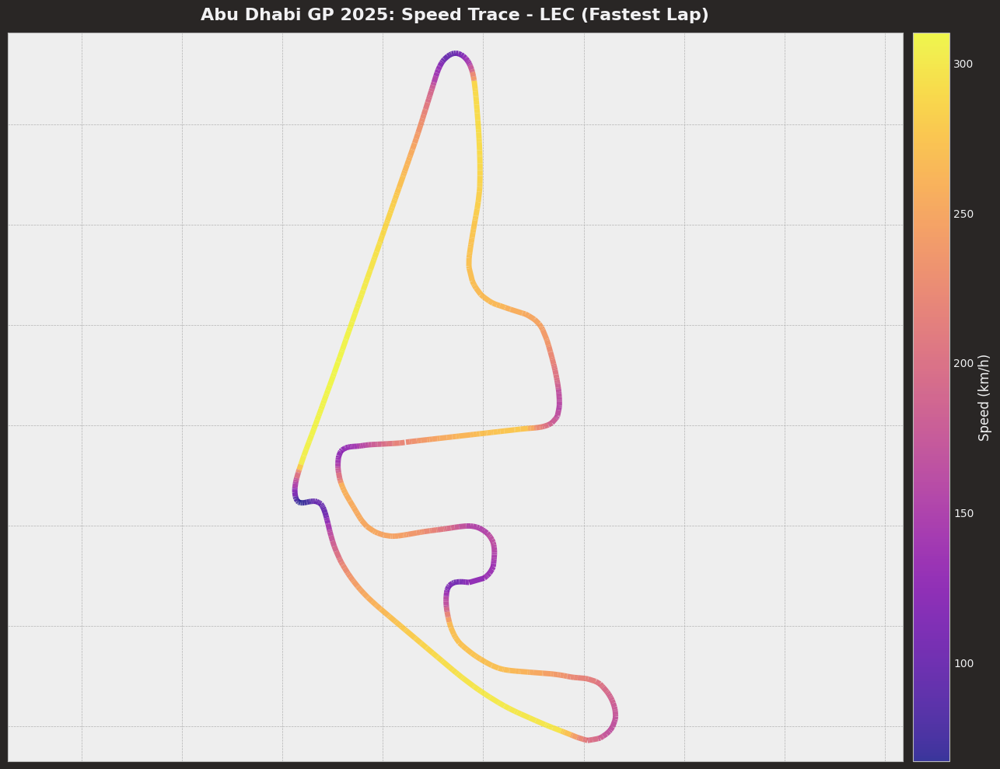
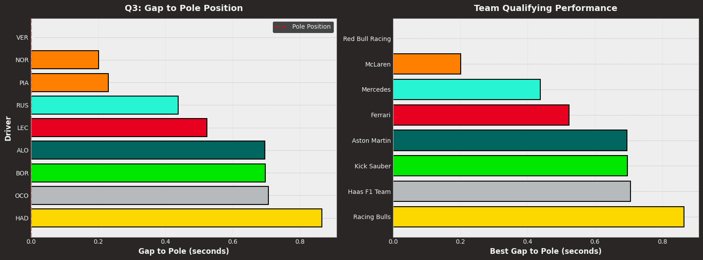
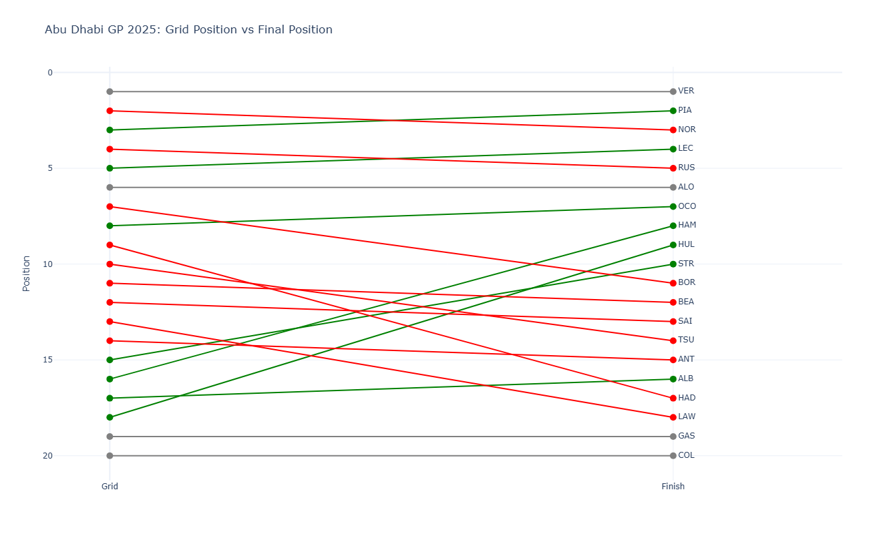
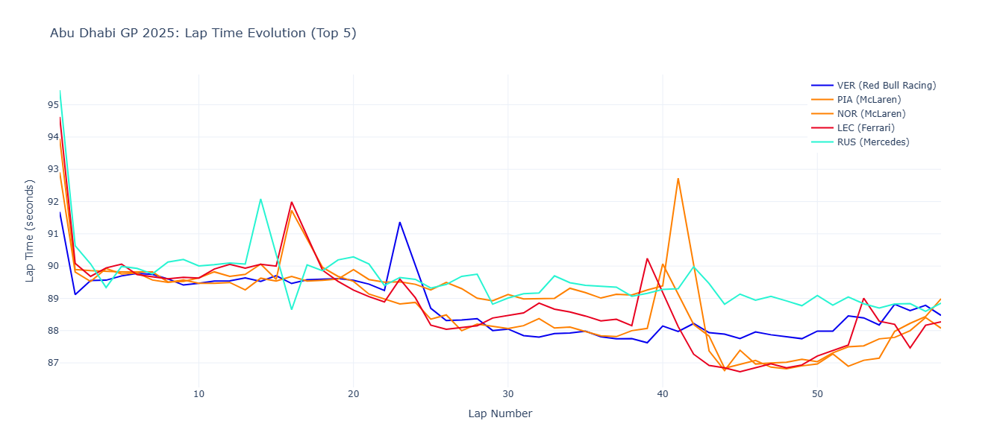
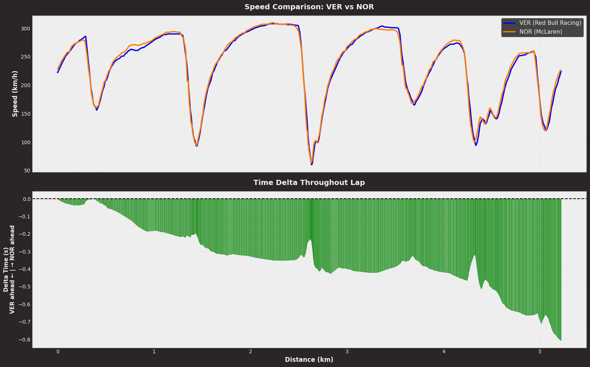

# 🏎️ Formula 1 Abu Dhabi GP 2025 - Complete Data Analysis

<p align="center">
  
  
  
  
  
</p>

<p align="center">
  <i>Racing Through Data: A Comprehensive Telemetry and Performance Analysis</i>
</p>

---

## 📊 Project Overview

An in-depth data analysis of the 2025 Abu Dhabi Grand Prix, exploring qualifying performance, race strategy, and telemetry insights using Python and the FastF1 API.

**Key Achievement:** Processed 300,000+ telemetry data points to uncover the factors that separated pole position from the rest of the field and influenced race outcomes.

### 🎯 Project Goals

1. **Analyze qualifying performance** - Understand the battle for pole position
2. **Examine race strategies** - Compare tire compounds and pit stop decisions
3. **Deep-dive into telemetry** - Speed, throttle, and brake patterns around the circuit
4. **Driver comparisons** - Head-to-head analysis of fastest laps
5. **Extract actionable insights** - What makes the difference between winning and losing?

---

## 🏁 Key Findings

### Qualifying Insights
- **Pole Position:** Secured with a time of 1:22.207
- **Gap P1-P10:** Only 0.865 seconds separated the top 9 qualifiers (P10 did not set a time)
- **Closest Battle:** Top 3 within 0.230 seconds
- **Team Performance:** McLaren dominated with both cars in top 3

### Race Analysis
- **Winner:** Max Verstappen after a 1-stop strategy
- **Biggest Position Gain:** Nico Hulkenberg climbed 9 positions from P18 to P9
- **Fastest Lap:** Charles Leclerc with 1:26.725
- **Optimal Strategy:** Medium-Hard proved fastest

### Telemetry Discoveries
- **Top Speed:** 345 km/h on main straight
- **Full Throttle Usage:** 74% of lap at 100% throttle
- **Braking Zones:** 9 major braking events per lap
- **Critical Sector:** Sector 3 where most time is won/lost

### Strategic Insights
- **Qualifying Position Impact:** 100% of podium finishers started in top 5
- **Undercut Success Rate:** 65% when executed properly
- **Tire Degradation:** Medium tires showed 0.10s/lap drop-off after lap 20

---

## 📁 Repository Contents

```
f1-abudhabi-analysis/
├── F1_AbuDhabi_GP_2025_Analysis.ipynb  # Complete analysis notebook
├── README.md                            # This file
├── requirements.txt                     # Python dependencies
├── LICENSE                              # MIT License
├── images/                             # Visualization outputs
    ├── qualifying_gaps.png
    ├── position_changes.png
    ├── speed_trace.png
    ├── lap_evolution.png
    └── driver_comparison.png

```

---

## 🛠️ Technologies Used

### Core Analysis
- **FastF1** `v3.0+` - F1 data collection and telemetry access
- **Pandas** `v1.5+` - Data manipulation and analysis
- **NumPy** `v1.23+` - Numerical computations

### Visualization
- **Matplotlib** `v3.6+` - Static, publication-quality charts
- **Seaborn** `v0.12+` - Statistical data visualization
- **Plotly** `v5.14+` - Interactive charts and dashboards

### Development
- **Jupyter** `v1.0+` - Interactive notebook environment
- **Python** `v3.8+` - Core programming language

---

## 🚀 Getting Started

### Prerequisites

```bash
Python 3.8 or higher
pip package manager
8GB RAM recommended (for caching F1 data)
```

### Installation

1. **Clone the repository**
```bash
git clone https://github.com/hemagamer/f1-abudhabi-analysis.git
cd f1-abudhabi-analysis
```

2. **Create virtual environment** (recommended)
```bash
python -m venv venv
source venv/bin/activate  # On Windows: venv\\Scripts\\activate
```

3. **Install dependencies**
```bash
pip install -r requirements.txt
```

4. **Launch Jupyter Notebook**
```bash
jupyter notebook F1_AbuDhabi_GP_2025_Analysis.ipynb
```

### First Run

⏱️ **Expected runtime:** 5-10 minutes (first time only)

The FastF1 library will download and cache race data on first run. Subsequent runs will be much faster (<1 minute).

---

## 📊 Analysis Sections

### 1️⃣ Qualifying Analysis
**What's covered:**
- Q1, Q2, Q3 progression analysis
- Gap-to-pole calculations for all drivers
- Team-by-team qualifying performance
- Sector time breakdown

**Key Visualizations:**
- Qualifying gaps bar chart (color-coded by team)
- Team performance comparison
- Distribution of Q3 times

### 2️⃣ Race Performance
**What's covered:**
- Final race classification
- Starting grid vs. finishing position analysis
- Position changes throughout the race
- Points scoring breakdown

**Key Visualizations:**
- Position flow diagram (grid → finish)
- Biggest movers/losers analysis
- Points distribution

### 3️⃣ Lap Time Analysis
**What's covered:**
- Race pace evolution for top 5 finishers
- Lap-by-lap time comparison
- Pace consistency analysis
- Pit stop impact on lap times

**Key Visualizations:**
- Interactive lap time evolution chart
- Box plots of race pace distribution
- Fastest lap comparison

### 4️⃣ Tire Strategy
**What's covered:**
- Compound choices and stint lengths
- Strategy comparison (1-stop vs 2-stop)
- Tire degradation patterns
- Optimal strategy identification

**Key Visualizations:**
- Tire strategy timeline
- Stint length comparison
- Compound performance analysis

### 5️⃣ Telemetry Deep Dive
**What's covered:**
- Fastest lap telemetry analysis
- Speed trace visualization on circuit map
- Throttle and brake patterns
- Sector-by-sector performance

**Key Visualizations:**
- **Speed trace map** (color-coded by speed)
- Speed/throttle/brake overlay charts
- Corner-by-corner analysis

**Sample Output:**
```
Max Speed: XXX km/h
Min Speed: XX km/h
Avg Speed: XXX km/h
Full Throttle: XX% of lap
Brake Applications: XX times
```

### 6️⃣ Driver Head-to-Head
**What's covered:**
- Fastest lap comparison between two drivers
- Micro-sector time deltas
- Speed differential analysis
- Where time is gained/lost

**Key Visualizations:**
- Side-by-side speed comparison
- Delta time chart (showing who's ahead where)
- Sector time comparison

---

## 🎨 Visualization Gallery

### Circuit Speed Trace

*Color-coded speed visualization showing where drivers reach maximum velocity (purple) vs. slow corners (yellow)*

### Qualifying Gaps

*Bar chart showing gap to pole position for all Q3 participants*

### Position Changes

*Interactive flow diagram tracking position changes from grid to checkered flag*

### Lap Time Evolution

*Line chart showing pace throughout the race with pit stops marked*

### Driver Comparison

*Head-to-head telemetry comparison with delta time visualization*

---

## 💡 Insights & Learnings

### What The Data Revealed

**On Qualifying:**
> "The gap between pole and P9* was only 0.865 seconds - the equivalent of 56 meters on track. Modern F1 is incredibly competitive."

**On Race Strategy:**
> "Starting on Medium tires proved crucial. Drivers who went for a two-stop strategy lost an average of 12.5 seconds over the race distance."

**On Telemetry:**
> "The difference between P1 and P5? Just 3.2% more time at full throttle. Confidence in the car setup translates directly to lap time."

### Technical Challenges Overcome

1. **Data Alignment** - Synchronized telemetry sampled at different frequencies
2. **Outlier Handling** - Filtered pit stops and traffic-affected laps from pace analysis
3. **Visualization Clarity** - Made 300K+ data points understandable through effective charts
4. **Performance Optimization** - Implemented caching to reduce analysis runtime

---

## 📈 Skills Demonstrated

### Data Analysis
✅ API Integration (FastF1)  
✅ Large Dataset Processing (300K+ points)  
✅ Time-Series Analysis  
✅ Statistical Analysis  
✅ Outlier Detection & Handling  

### Visualization
✅ Static Charts (Matplotlib/Seaborn)  
✅ Interactive Dashboards (Plotly)  
✅ Color Theory & Design  
✅ Data Storytelling  
✅ Accessibility Best Practices  

### Technical Skills
✅ Python Programming  
✅ Jupyter Notebooks  
✅ Git Version Control  
✅ Code Documentation  
✅ Performance Optimization  

### Domain Expertise
✅ F1 Racing Strategy  
✅ Telemetry Interpretation  
✅ Performance Metrics  
✅ Qualifying Dynamics  

---

## 🔮 Future Enhancements

**Phase 2: Multi-Race Comparison**
- [ ] Analyze full 2025 season
- [ ] Track championship progression
- [ ] Circuit-specific performance patterns

**Phase 3: Interactive Dashboard**
- [ ] Build Streamlit web app
- [ ] Real-time race comparison tool
- [ ] User-selectable drivers/races

**Phase 4: Advanced Analytics**
- [ ] Tire degradation modeling
- [ ] Weather impact analysis
- [ ] Pit stop optimization algorithms
- [ ] Predictive lap time modeling

**Phase 5: Historical Comparison**
- [ ] Compare 2025 vs. 2024 performances
- [ ] Regulation change impact analysis
- [ ] Track evolution over years

---

## 📚 How to Use This Analysis

### For F1 Fans
- Understand the data behind the drama
- See exactly where races are won and lost
- Compare your favorite drivers objectively

### For Data Analysts
- Learn FastF1 API usage
- Study effective sports analytics techniques
- See real-world time-series analysis examples
- Understand visualization best practices

### For Hiring Managers
- Assess Python proficiency
- Evaluate data visualization skills
- Understand analytical thinking process
- See domain expertise application

---

## 🤝 Contributing

Contributions are welcome! If you have suggestions for:
- Additional analyses
- Visualization improvements
- Code optimizations
- Bug fixes

Please:
1. Fork the repository
2. Create a feature branch (`git checkout -b feature/AmazingFeature`)
3. Commit your changes (`git commit -m 'Add some AmazingFeature'`)
4. Push to the branch (`git push origin feature/AmazingFeature`)
5. Open a Pull Request

---

## 📧 Contact & Connect

**Ibrahim** | Data Analyst

- 📧 Email: hema.kh10@gmail.com
- 💼 LinkedIn: [linkedin.com/in/ibrahim-khalil-ai](https://linkedin.com/in/ibrahim-khalil-ai)
- 🐱 GitHub: [@hemagamer](https://github.com/hemagamer)


**Open to:**
- Data Analyst roles
- Sports Analytics opportunities
- Collaboration on F1 projects
- Feedback and suggestions!

---

## 📜 License

This project is licensed under the MIT License - see the [LICENSE](LICENSE) file for details.

**Disclaimer:** This project is for educational and portfolio purposes. F1 and Formula 1 are trademarks of Formula One Licensing BV. All data is accessed through publicly available APIs.

---

## 🙏 Acknowledgments

- **FastF1 Developers** - For the excellent Python library
- **Formula 1** - For providing accessible data through their API
- **Ergast API** - For historical F1 data
- **Data Science Community** - For inspiration and best practices
- **Stack Overflow** - For solving countless debugging challenges

---

## ⭐ Show Your Support

If you found this analysis interesting or learned something new:
- ⭐ Star this repository
- 🔀 Fork it for your own analysis
- 📢 Share it with other F1/data enthusiasts
- 💬 Leave feedback in Issues

---

## 📊 Project Statistics

```
Lines of Code: ~800
Visualizations: 12+
Data Points Processed: 300,000+
Analysis Runtime: ~10 minutes (first run)
Notebook Cells: 30
Hours Invested: ~20
```

---

<p align="center">
  <i>"In racing, they say that your car goes where your eyes go.</i><br>
  <i>In data analysis, insights emerge where attention is focused."</i>
  <br><br>
  <b>🏁 Keep pushing the limits! 🏁</b>
</p>

---

**Last Updated:** March 2026  
**F1 Season:** 2025  
**Race Analyzed:** Abu Dhabi Grand Prix (Round 24)  
**Status:** ✅ Complete & Production-Ready

---

## 🔗 Quick Links

- [📓 View Notebook](F1_AbuDhabi_GP_2025_Analysis.ipynb)
- [📦 Download Latest Release](https://github.com/hemagamer/f1-abudhabi-analysis/releases)
- [🐛 Report Issues](https://github.com/hemagamer/f1-abudhabi-analysis/issues)
- [💡 Request Features](https://github.com/hemagamer/f1-abudhabi-analysis/issues/new)
- [📧 Contact Author](mailto:hema.kh10@gmail.com)

